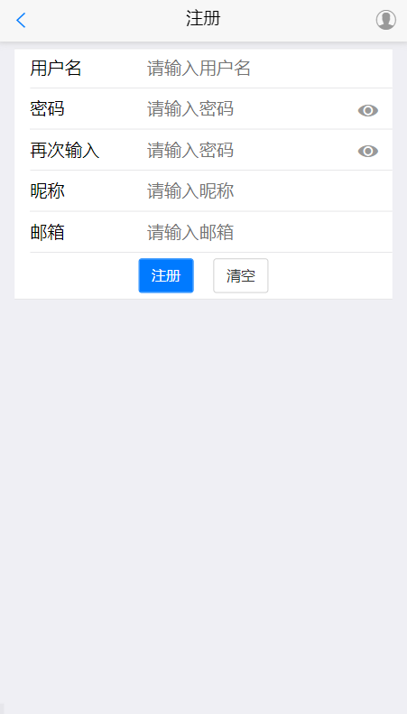
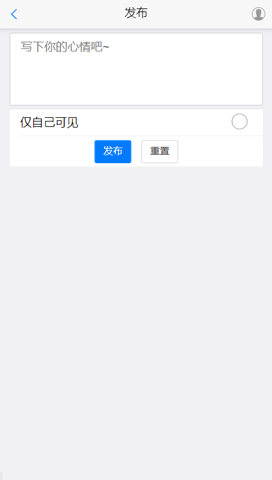
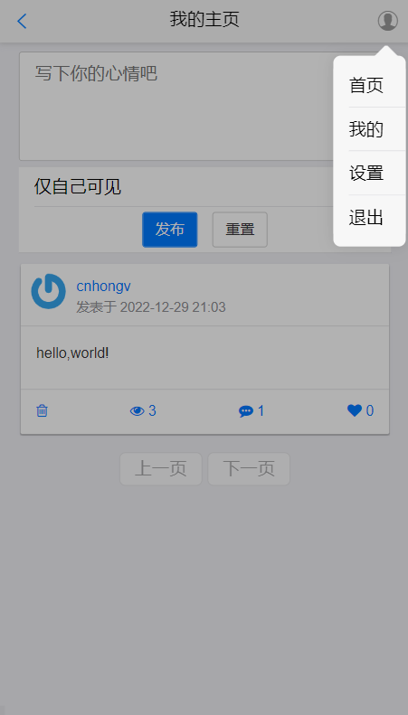
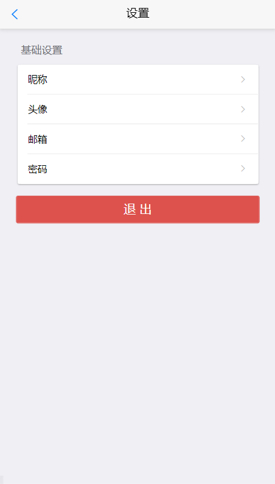

# 项目介绍
本项目是笔者的结课作业，基于Python+Django+SQLite实现的简单微博系统。因为是作业，为避免被直接clone作为作业，上传了除前端页面源码之外的内容，截图仅供参考。

# 系统环境

- 操作系统：Windows 11
- 运行环境：Python 3.9.7
- 系统框架：Django 4.1.3
- 开发软件：Visual Studio Code


# 已实现的功能

- [x]注册微博
- [x]登录微博
- [x]登录微博
- [x]发布微博
- [x]删除微博
- [x]点赞微博
- [x]评论微博
- [x]删除评论
- [x]找回账号
- [x]设置头像
- [x]修改邮箱
- [x]修改密码

# 未实现功能
- [ ]转发微博
- [ ]关注用户
- [ ]站内信
- [ ]...

# 效果参考截图

> 本项目未上传前端页面源码，如需帮助请在issue留言

## 首页


## 注册


## 发布


## 个人主页


## 设置


# 运行项目

## 下载源码

```sh
git clone https://github.com/cnhongv/PyWeibo
```

## 初始化数据库

```sh
cd ./pyweibo
python manage.py migrate
python manage.py makemigrations
python manage.py migrate
```

## 运行项目

```sh
python manage.py runserver
```
